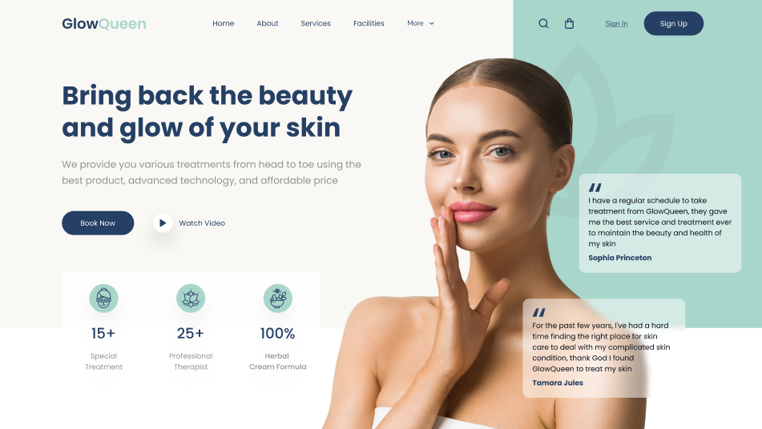

# Header_Spa-Beauty



Este es un diseño de encabezado para una página de **SPA & Beauty**, creado como diseño final del módulo de css del curso de Conquer Blocks, aplicando lo aprendido en los módulos de html i css.  
El diseño está hecho con **HTML, CSS y SCSS**, utilizando buenas prácticas de estructura y estilos modernos.

## 🛠️ Proceso de Desarrollo  

El desarrollo de este proyecto siguió una serie de pasos organizados para transformar el diseño en un producto funcional y atractivo:  

### 1️⃣ Análisis del Diseño en Figma  
El punto de partida fue un archivo **.fig** en **Figma**, que contenía el diseño final del encabezado. A partir de ahí, se realizó un análisis de la estructura, los elementos gráficos y la tipografía utilizada.  

### 2️⃣ Extracción de Recursos  
- Se descargaron todas las **imágenes** y **SVGs** necesarios para el diseño.  
- Se identificó la **tipografía** empleada en el diseño y se obtuvo desde **Google Fonts**.  
- Se extrajeron los **colores principales** de la interfaz para garantizar coherencia visual en el desarrollo.  

### 3️⃣ Creación de la Estructura HTML  
Con los recursos listos, se redactó el **archivo HTML**, definiendo la estructura semántica de la página:  
- Se utilizaron etiquetas adecuadas (`header`, `nav`, `section`, etc.) para mejorar la accesibilidad y el SEO.  
- Se organizaron correctamente los elementos para facilitar la aplicación de estilos.  

### 4️⃣ Estilización con SASS (Preprocesador CSS)  
Una vez definida la estructura HTML, se procedió a aplicar estilos con **SASS** para mantener el código limpio y modular:  
- Se crearon **variables** para los colores y la tipografía.  
- Se usaron **mixins** para mejorar la organización del código.  
- Se aplicó **Flexbox** para lograr una distribución estructurada.  

### 5️⃣ Interacción y Animaciones  
Para mejorar la experiencia del usuario, se añadieron interacciones con **hover** en botones y enlaces:  
- Se agregaron transiciones suaves para un efecto más elegante.  
- Se implementaron efectos visuales en los elementos interactivos.  


## 🚀 Tecnologías utilizadas  

- **HTML5** - Estructura del contenido  
- **CSS3** - Estilos y diseño  
- **SCSS** - Preprocesador CSS para mejor organización  
- **Flexbox & Grid** - Diseño responsivo
- **Git i Github** - Sincronización del repositorio en local y en remoto

## 🔥 Vista previa  

Puedes ver una demo en **GitHub Pages**:
[https://arnaunin.github.io/Header_Spa-Beauty/code/](https://arnaunin.github.io/Header_Spa-Beauty/code/)

## 🛠️ Instalación y uso
1. Clona el repoitorio:
```
https://github.com/arnaunin/Header_Spa-Beauty.git
```
2. Navega al repositorio:
```
cd Header_Spa-Beauty
```
3. Instalación de sass:
```
npm install -g sass
```
4. Hacer el Watch con sass
```
sass --watch sass/app.scss css/app.css
```
5. Abrir en VsCode

## 🤝 Contribuciones

Este repositorio es personal, pero si quieres proponer mejoras a alguna de mis soluciones, estaré encantado de recibir tus sugerencias. Simplemente abre un **issue** o envíame una **pull request**.
